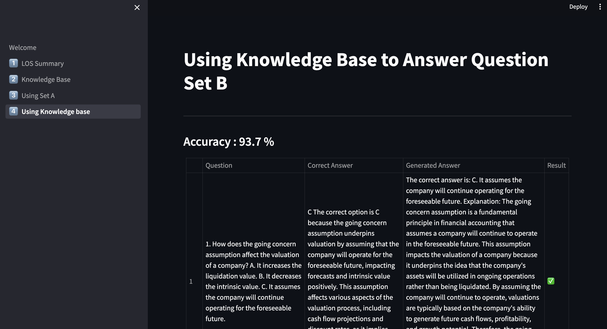

## Big Data Systems and Intelligence Analytics (DAMG 7245)

| Name         | Email                        | NUID    |
| ------------ | ---------------------------- | ------- |
| Ameya Apte   | apte.ame@northeastern.edu    | 2764540 |
| Sayali Dalvi | dalvi.sa@northeastern.edu    | 2799803 |
| Soeb Hussain | hussain.soe@northeastern.edu | 2747200 |

# Assignment 5 

## Problem Statement

The objective of this project is to develop an intelligent system for the extraction and structuring of professional development resources in finance using Models as a Service APIs. By leveraging the capabilities of OpenAI's GPT and Pinecone vector database, the system aims to enhance knowledge retrieval and Q/A tasks to support financial professionals in their learning and development.

Development of Knowledge Summaries


1. Extraction

    * Identify the URLs of the CFA Institute's website where the relevant documents are located.
    * Use a web scraping tool (e.g., BeautifulSoup, Scrapy) to programmatically extract the text data (Introduction, Summary, LOS) from these pages.

2. Extract text data (Introduction, Summary, LOS) from the assigned documents.
    * Use OpenAI’s GPT to create detailed summaries based on the LOS (Learning Outcome Statements).
    * Convert and consolidate all summaries into a markdown document.
    * Chunk each LOS and associated summary for storage in the Pinecone vector database.
3. Creation of a Knowledge Base for Q/A

    * Develop a set of 50 multiple-choice questions (Set A) from the summaries, modeling them on CFA Institute’s sample questions.
    * Generate another set of 50 questions (Set B) as a test set.
    * Store Set A in Pinecone with separate namespaces for questions and answers.

4. Implementation of Vector Database for Q/A Matching

    * Utilize the Pinecone vector database and RAG (Retrieval-Augmented Generation) to find answers to questions in Set B using the stored Set A.
    * Perform a comparison of the generated answers against the correct answers to evaluate the accuracy of the retrieval system.
5. Knowledge Summaries Utilization for Q/A

    * Search for similar embeddings and LOS in the vector database that could potentially answer the questions in Set B.
    * Evaluate which method (direct Q/A matching vs. using knowledge summaries for answering) provides more accurate results.

 
## Objective :

* Streamlit Application Development:
    * Design and develop a user-friendly interface for file upload.
    * Authentication page for safe access to data
    * Implement file storage functionality to upload files to S3.
    * Integrate functionality to trigger the Airflow pipeline upon file upload.

* Airflow Pipeline Development:

    * Set up an Airflow environment.
    * Create DAGs for the data extraction, validation, and loading processes.
    * Ensure the pipeline is triggered by the Streamlit app via the Fast API service.


* Snowflake Setup and Integration:

    * Configure Snowflake and local file system for data storage.
    * Ensure the Airflow pipeline can load data efficiently.
    * Set up necessary schemas and Access management.

* Dockerization and Deployment:

    * Containerize the Streamlit app and all services using Docker.
    * Deploy all services to a cloud platform ensuring they are accessible online.

## Live application links 
* [Codelabs](https://codelabs-preview.appspot.com/?file_id=1xOGcMhYwCmjjOB1ChA7WBFG2N_Q2OKIhKTld12A6qSM#5)
* [Streamlit](http://35.237.26.187:8501/)


## Technologies Used


[](https://www.python.org/)
[](https://github.com/)
[](https://streamlit.io/)
[
](https://www.snowflake.com/en/?_ga=2.41504805.669293969.1706151075-1146686108.1701841103&_gac=1.160808527.1706151104.Cj0KCQiAh8OtBhCQARIsAIkWb68j5NxT6lqmHVbaGdzQYNSz7U0cfRCs-STjxZtgPcZEV-2Vs2-j8HMaAqPsEALw_wcB)

[](https://airflow.apache.org/)
[](https://fastapi.tiangolo.com/)
[](https://www.docker.com)
[](https://cloud.google.com)

## Project Structure 
```
```
©generated by [Project Tree Generator](https://woochanleee.github.io/project-tree-generator)

## Architecture Diagram


## Streamlit UI
**LOS Summary:** You can select the CFA topic from the drop down to view it’s corresponding LOS and summary


**Knowledge Base:** Here we display the Question Set A that we generated by prompting the OpenAI LLM using Introduction, Summary and LOS for that CFA topic.


**Using Set A:** Here we display the report of our first experiment where we generate the answers for Question Set B using Set A answers as a context. The result column clearly displays if it was correctly generated or not. At the top you see the accuracy for all the questions


**Using Knowledge Base:** Here we display the report of answers generated using Knowledge Base.


## Prerequisites
Before setting up the project, please make sure you have the following prerequisites installed and configured:

- **Python**: The project is built with Python. Ensure you have Python installed on your system. You can download it from [python.org](https://www.python.org/).

- **Docker**: This project uses Docker containers for ensuring consistency across various development environments. Install Docker Desktop from [Docker's official site](https://www.docker.com/products/docker-desktop).

- **Virtual Environment**: Use a virtual environment to manage the project's dependencies separately from other Python projects on your system. You can create a virtual environment using tools like `virtualenv` or the built-in `venv` module:
    ``` 
    python -m venv venv
    source venv/bin/activate  # On Windows use venv\Scripts\activate 
    ```
  

## How to use
* Clone the project repository:
        ```git clone <repository-url>```

* Configure .env files at the following locations:
    ```
    .env
    airflow/config/.env
    
    ```
* Build the containers ```docker-compose build```
* Start the containers ```docker-compose up```

## How to contribute

### Installation 

* Clone the project repository:
        ```git clone <repository-url>```

* Navigate to the a project directory:
        ```cd <component folder>```

* Activate the virtual environment:
```source venv/bin/activate ```

* Install the required dependencies:
```pip install -r requirements.txt```


